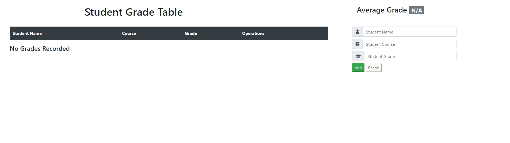

# student-grade-table
An interactive JavaScript application that communicates with a server to manage grade records.

## Technologies Used

- JavaScript
- jQuery
- Bootstrap 4
- HTML5
- CSS3
- AWS EC2

## Live Demo

Try the application live at [https://student-grade-table.brandonmontes.com](https://student-grade-table.brandonmontes.com)

## Features

- Teachers can view a list of recorded grades.
- Teachers can view the average grade.
- Teachers can add a grade to the table.
- Teachers can delete a grade from the table.

## Preview



## Development

### System Requirements

- JQuery 3.5.1

### Getting Started

1. Clone the repository.

    ```shell
    git clone https://github.com/brandonmontes/student-grade-table
    cd student-grade-table
    ```

1. Start the project. Once started you can view the application by opening the index.html in your browser
